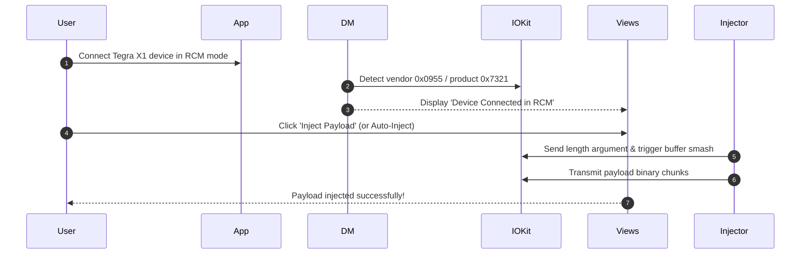

# Key flows

```mermaid
sequenceDiagram
    autonumber
    User->>App: Connect Tegra X1 device in RCM mode
    DM->>IOKit: Detect vendor 0x0955 / product 0x7321
    DM-->>Views: Display 'Device Connected in RCM'
    User->>Views: Click 'Inject Payload' (or Auto-Inject)
    Injector->>IOKit: Send length argument & trigger buffer smash
    Injector->>IOKit: Transmit payload binary chunks
    Views-->>User: Payload injected successfully!
```
