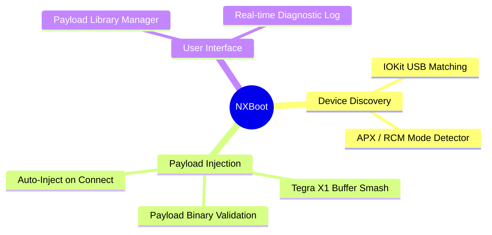

# Feature mindmap

```mermaid
mindmap
  root((NXBoot))
    Device Discovery
      IOKit USB Matching
      APX / RCM Mode Detector
    Payload Injection
      Tegra X1 Buffer Smash
      Payload Binary Validation
      Auto-Inject on Connect
    User Interface
      Payload Library Manager
      Real-time Diagnostic Log
```
